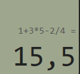
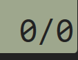
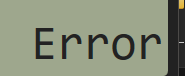
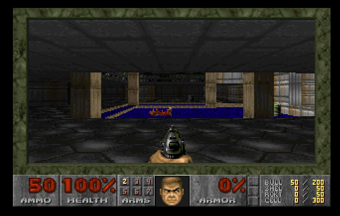

 

  <h1 align="center">DoomCalc - PAC4 Calculadora I</h1>

  

    Calculadora d'escriptori feta amb <strong>WPF + C#</strong> per a la PAC #4 de Desenvolupament d'Interfícies.
     
    Integra un motor d’avaluació d’expressions complexes, suport integral de teclat i un Easter Egg de DOOM.
  

---

##  Índex

  
Mostra / amaga l'índex

  <ol>
    <li><a href="#sobre-el-projecte">Sobre el projecte</a></li>
    <li><a href="#requisits-del-sistema">Requisits del Sistema</a></li>
    <li><a href="#funcionalitats-principals">Funcionalitats Principals</a></li>
    <li><a href="#installació-i-execució">Instal·lació i execució</a></li>
    <li><a href="#guia-dús-i-navegació">Guia d’Ús i Navegació</a></li>
    <li><a href="#exemples-pràctics-i-captures">Exemples Pràctics i Captures</a></li>
    <li><a href="#resolució-de-problemes-faq">Resolució de Problemes (FAQ)</a></li>
    <li><a href="#estil-i-disseny-del-readme">Estil i Disseny del README</a></li>
    <li><a href="#conclusions">Conclusions</a></li>
    <li><a href="#autoria-i-llicència">Autoria i Llicència</a></li>
  </ol>

---

##  Sobre el projecte

Aquest projecte consisteix en el desenvolupament d’una calculadora multiplataforma bàsica utilitzant l’entorn WPF (Windows Presentation Foundation) sobre .NET 10.

L’aplicació va més enllà d’un simple disseny visual, integrant un motor d’avaluació d’expressions complexes i control natiu de jerarquies operatives. A mentalitat d'accessibilitat, compta amb capacitat d’ús total mitjançant teclat físic i amaga un component interactiu integrat de forma local a mode d’Ou de Pasqua (Easter Egg). Tota la documentació tècnica està preparada per ser generada amb **Doxygen**.

(<a href="#readme-top">tornar a dalt</a>)

---

##  Requisits del Sistema

Per garantir el correcte funcionament de la interfície i del mòdul WebAssembly ocult, es requereix:

* **Sistema Operatiu:** Windows 10 o Windows 11 (64-bit).
* **Entorn d’Execució:** .NET 10.0 SDK / Runtime o superior.
* **Dependències:** Microsoft Edge WebView2 Runtime (necessari per a la renderització del motor de joc local).
* **IDE:** Visual Studio 2022.

(<a href="#readme-top">tornar a dalt</a>)

---

##  Funcionalitats Principals

* **Operacions Encadenades:** Permet introduir cadenes de càlcul complexes d’una sola vegada (Ex: 5+3*2-4/2).
* **Prioritat Matemàtica Nativa:** El motor processa les expressions respectant de manera estricta que multiplicacions i divisions s’executin abans que les sumes i restes.
* **Control d’Errors Interactiu:** Sistema de validació en temps real que bloqueja operadors consecutius i divisions per zero, mostrant l’estat *Error* al panell LCD.
* **Mapatge de Teclat Físic (Accessibilitat):** Suport integral per utilitzar el teclat numèric estàndard i el bloc numèric d’escriptori gràcies a la captura d’esdeveniments `PreviewKeyDown`.
* **Mode Aïllat (Easter Egg):** En introduir el codi de seguretat `666`, la calculadora desapareix per carregar un entorn web emulat localment que executa DOOM (1993) a pantalla completa.

(<a href="#readme-top">tornar a dalt</a>)

---

##  Instal·lació i execució

Segueix aquests passos seqüencials per compilar i executar el projecte al teu entorn local:

1. Clonar el repositori des de la terminal bash:

    git clone https://github.com/[El-Teu-Usuari]/PAC4-Calculadora.git

2. Obre el projecte amb **Visual Studio 2022** (fitxer `PAC4-Calculadora.slnx` o `.csproj`).
3. Compila el projecte perquè es restaurin les dependències.
4. Executa l'aplicació prement `F5`.

(<a href="#readme-top">tornar a dalt</a>)

---

##  Guia d’Ús i Navegació

Aquest apartat descriu tant la distribució dels components a la interfície gràfica com els fluxos de control d’entrada de dades.

###  Distribució ESTRUCTURAL de la Interfície (Layout)
La interfície es compon d’una finestra única estructurada verticalment en dues regions principals mitjançant un contenidor natiu `Grid`:

1. **Regió de Visualització (Capa Superior):** Dissenyada emulant un panell LCD clàssic mitjançant un contenidor `Border` amb fons verd oliva (#9EA78D). Conté dues línies:
   * **Línia d’Historial (`CalcEquation`):** Mostra l’expressió acumulada completa.
   * **Línia Principal (`CalcDisplay`):** Mostra l’entrada en temps real, resultats o errors.

2. **Regió Operativa (Capa Inferior):** Organitzada mitjançant un control `UniformGrid` de 4 columnes que distribueix de manera simètrica la botonera tàctil.

###  Sistema Avançat de Control per Teclat Físic
L’aplicació implementa accessibilitat total safe-focus interceptant l’esdeveniment descendent `PreviewKeyDown`:

| Entrada de Teclat Físic | Codi Virtual Interceptat (Key) | Destí Operatiu Associat |
| --- | --- | --- |
| Dígits 0 al 9 (Bloc Principal) | `Key.D0` fins `Key.D9` | Mètode `Value_Click` |
| Dígits 0 al 9 (Teclat Numèric) | `Key.NumPad0` fins `Key.NumPad9` | Mètode `Value_Click` |
| Tecla de Suma (+) | `Key.Add` o `Key.OemPlus` | `Operation_Click` |
| Tecla de Resta (-) | `Key.Subtract` o `Key.OemMinus` | `Operation_Click` |
| Tecla de Multiplicació (*) | `Key.Multiply` | Tradueix a × i invoca `Operation_Click` |
| Tecla de Divisió (/) | `Key.Divide` o `Key.Oem2` | Tradueix a ÷ i invoca `Operation_Click` |
| Tecla d’Execució (Enter) | `Key.Enter` | Lògica de `Result_Click` |
| Tecla de Neteja (Esc / C) | `Key.Escape` o `Key.C` | Restabliment total mitjançant `Clear_Click` |

(<a href="#readme-top">tornar a dalt</a>)

---

##  Exemples Pràctics i Captures

S’exposen els tres escenaris principals d’execució del sistema.

### **1.** Escenari A: Càlcul Polinòmic amb Prioritat d’Operadors
* **Cadena d’Entrada:** `1 + 3 × 5 - 2 / 4 =`
* **Processament Intern:** La classe `DataTable` processa l’expressió linealitzada en memòria. Primer calcula productes i quocients, transformant l’expressió a `1+15-0.5`.
* **Resultat Visualitzat:** `15.5`

### **2.** Escenari B: Intercepció d’Excepcions Aritmètiques
* **Cadena d’Entrada:** `8 ÷ 0 =`
* **Processament Intern:** El fil intercepta l’error al bloc `try-catch` (divisió per zero o NaN) i desvia el flux cap al mètode `MostrarError()`.
* **Resultat Visualitzat:** `Error`

 

### **3.** Escenari C: Entorn Aïllat (Easter Egg - DOOM)
* **Cadena d’Entrada:** `6 6 6`
* **Processament Intern:** En confirmar el patró "666", s'invoca `RunDoomFullScreen()`, es maximitza la finestra, es col·lapsa la quadrícula gràfica i s'inicialitza el motor WebAssembly sobre WebView2.

(<a href="#readme-top">tornar a dalt</a>)

---

##  Resolució de Problemes (FAQ)

###  Problema 1: L'error CS0246 ('wv2' no s’ha trobat)
* **Causa:** Falta la restauració dels components de l’SDK d’emulació a NuGet.
* **Solució:** Obre la Consola de l’Administrador de Paquets de Visual Studio i executa aquesta comanda de powershell:

    Update-Package -Reinstall -Source nuget.org

(<a href="#readme-top">tornar a dalt</a>)

---

##  Estil i Disseny del README

Aquest document utilitza una estructura visual avançada per millorar la navegació i presentació de la informació en plataformes com GitHub:

* **Capçalera Centrada:** S'empren etiquetes HTML `
` i `align="center"` per estructurar el títol principal i la descripció de manera simètrica.
* **Insígnies Dinàmiques (Badges):** S'integren vectors externs connectats a Shields.io per mostrar visualment i d'un sol cop d'ull la pila tecnològica del projecte (C#, WPF, .NET 10, WebView2 i Doxygen).
* **Índex Interactiu Desplegable:** S'utilitzen els elements natius d'HTML `
` i `
` per encapsular la taula de continguts, permetent optimitzar l'espai i netejar la lectura inicial.
* **Navegació de Retorn Ràpid:** S'estableix un ancoratge ocult al punt superior del document (`readme-top`) connectat a enllaços flotants a la dreta de cada secció principal per facilitar la tornada al menú sense necessitat de fer scroll manual.

(<a href="#readme-top">tornar a dalt</a>)

---

##  Conclusions

El desenvolupament d’aquest programa ha servit per consolidar els conceptes d'arquitectura de programari:

* Hem après a organitzar millor la interfície utilitzant **WPF**, separant el disseny de la lògica del programa.
* Hem combinat aplicacions d’escriptori amb tecnologies web gràcies a **WebView2 i WebAssembly**.
* Hem integrat documentació professional utilitzant eines com **Doxygen** i fitxers **Markdown**.

(<a href="#readme-top">tornar a dalt</a>)

---

##  Autoria i Llicència

Projecte desenvolupat per:
* **Joan Valdez**
* **Martí Font**

**Cicle:** Desenvolupament d’Aplicacions Multiplataforma (DAM)  
**Mòdul:** M0488 - Desenvolupament d’Interfícies  

(<a href="#readme-top">tornar a dalt</a>)
